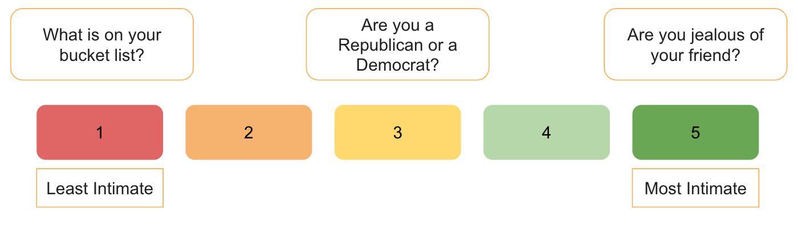

# Tweet Intimacy Analysis
 

 

 

The goal of this project is to train machine learning models to recognize intimacy in text.
The authors of ["Quantifying Intimacy in Language"](https://aclanthology.org/2020.emnlp-main.428.pdf) defined intimacy as "closeness and interdependence, self-disclosure, and warmth or affection" in the languages we use to communicate. Intimacy is on a scale of one to five.

There are two datasets, [the Reddit Questions dataset](https://codalab.lisn.upsaclay.fr/competitions/7096#learn_the_details-overview) and the [Multilingual Tweet Intimacy
dataset](https://github.com/Jiaxin-Pei/Quantifying-Intimacy-in-Language/blob/main/data/annotated_question_intimacy_data.zip), used in this project.

## Methodology
We downloaded the pre-trained roBERTa model and made three copies of it.
The three models were trained on the Reddit questions set, Multilingual Tweet dataset and a combination of the two.

## Collaborators
Orion Lowy, Jordan Yu and Aisha Farooque

## References

- Jiaxin Pei and David Jurgens. 2020. Quantifying Intimacy in Language. In Proceedings of the 2020 Conference on Empirical Methods in Natural Language Processing (EMNLP), pages 5307–5326. Association for Computational Linguistics.
- Jiaxin Pei, Vítor Silva, Maarten Bos, Yozon Liu, Leonardo Neves, David Jurgens and Francesco Barbieri. 2022. SemEval 2023 Task 9: Multilingual Tweet Intimacy Analysis In arXiv:2210.01108
- Francesco Barbieri, Luis Espinosa Anke, Jose Camacho-Collados. 2021. XLM-T: Multilingual Language Models in Twitter for Sentiment Analysis and Beyond. In arXiv:2104.12250
